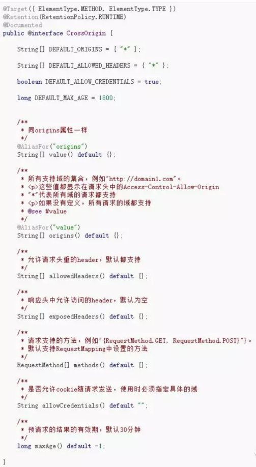

# spring mvc的跨域解决方案

###  什么是跨域

同一个ip、同一个网络协议、同一个端口，三者都满足就是同一个域，否则就是跨域。

### 为什么非得跨域

基于两个方面：

1. web应用本身是部署在不同的服务器上
2. 基于开发的角度 --- 前后端分离

web应用本身是部署在不同的服务器上，对应的域名也就有所不同

比如百度：

- 主域名：https://www.baidu.com/
- 二级域名：http://image.baidu.com/， http://music.baidu.com/，http://wenku.baidu.com

需要在不同的域之间，通过ajax方式互相请求，是非常常见的需求。

### spring使用jsonp解决跨域

Spring 4中增加了对jsonp的原生支持，只需要ControllerAdvice就可以开启，方法如下： 
首先新建一个Advice类，我们叫做“JsonpAdvice”，然后在里面定义接收jsonp请求的参数key：

	import org.springframework.web.bind.annotation.ControllerAdvice;
	import org.springframework.web.servlet.mvc.method.annotation.AbstractJsonpResponseBodyAdvice;
	/**
	* 使用jsonp实现跨域的支持      
	*/
	@ControllerAdvice("cn.isyweb.sso.web")
	public class JsonpAdvice extends AbstractJsonpResponseBodyAdvice {
	   public JsonpAdvice() {
	       super("callback");
	   }
	}

@ControllerAdvice("cn.isy.web.sso.web")指定作用的包名 
supper("callback")指定的是url中callback：
http://sso.isy.cn/logout?callback=successCallback

controller中的代码正常编写就OK，不用修改任何东西。
只要保证在cn.isy.web.sso.web包下即可！

jquery ajax 注意：必须使用jsonp的方式提交请求！
	
	$.ajax({  
	     type : "get",  
	     async:false,  
	     dataType:'jsonp',
	     url: 'http://sso.isy.cn/login.json',
	     data: $("#loginForm").serialize(),
	     crossDomain: true,
	     jsonpCallback:"successCallback", 
	     xhrFields: {
	        withCredentials: true
	     },
	     success : function(data){ 
	                  
	     },  
	     error:function(data){  
	        console.log("登录出错");
	        $.we.utils.gotoUrl("/");
	      }  
	});

### 使用CORS(跨域资源共享)解决跨域问题

跨资源共享CORS详解 

主要配置
	
	Access-Control-Allow-Origin:  http://www.YOURDOMAIN.com            // 设置允许请求的域名，多个域名以逗号分隔
	Access-Control-Allow-Methods: GET, POST, PUT, DELETE, OPTIONS      // 设置允许请求的方法，多个方法以逗号分隔
	Access-Control-Allow-Headers: Authorization                        // 设置允许请求自定义的请求头字段，多个字段以逗号分隔
	Access-Control-Allow-Credentials: true                              // 设置是否允许发送 Cookies

使用注解CrossOrigin

在controller类上添加CrossOrigin注解表示当前类中的所有入口函数都
可以实现跨域。也可以指定某个conroller中具体的方法。

了解一下这个注解的内容：

jquery ajax的写法

注意：这里不用使用jsonp的方式请求普通的ajax即可

	     $.ajax({  
	               type : "get",  
	               url: 'http://sso.isy.cn/login.json',
	               data: $("#loginForm").serialize(),
	               xhrFields: {
	                   withCredentials: true //注意这里必须指定否则cookie无法传递过去
	               },
	               success : function(data){ 
	                  
	               },  
	               error:function(data){  
	                   console.log("登录出错");
	                   $.we.utils.gotoUrl("/");
	               }  
	           });