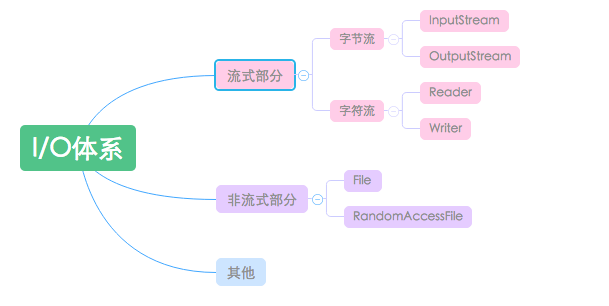
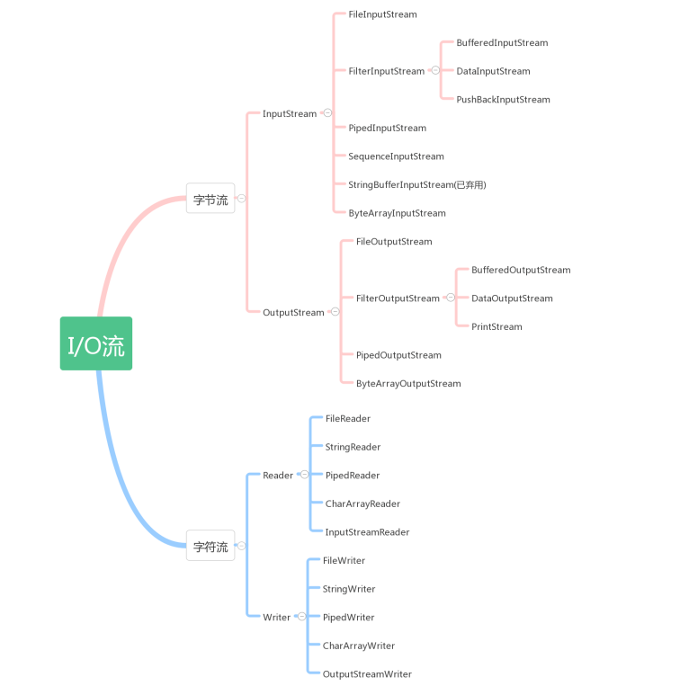

# Java IO

Java.io包中最重要的就是5个类和一个接口。5个类指的是File、OutputStream、InputStream、Writer、Reader；一个接口指的是Serializable

主要类：

1. File（文件特征与管理）：用于文件或者目录的描述信息，例如生成新目录，修改文件名，删除文件，判断文件所在路径等。
2. InputStream（字节流，二进制格式操作）：抽象类，基于字节的输入操作，是所有输入流的父类。定义了所有输入流都具有的共同特征。
3. OutputStream（字节流，二进制格式操作）：抽象类。基于字节的输出操作。是所有输出流的父类。定义了所有输出流都具有的共同特征
4. Reader（字符流，文本格式操作）：抽象类，基于字符的输入操作。
5. Writer（字符流，文本格式操作）：抽象类，基于字符的输出操作。
6. RandomAccessFile（随机文件操作）：它的功能丰富，可以从文件的任意位置进行存取（输入输出）操作。

### I/O流

java.io包里有4个基本类：InputStream、OutputStream及Reader、Writer类，它们分别处理字节流和字符流。

按来源去向分类

1. File（文件）： FileInputStream, FileOutputStream, FileReader, FileWriter
2. byte[]：ByteArrayInputStream, ByteArrayOutputStream
3. Char[]: CharArrayReader, CharArrayWriter
4. String: StringBufferInputStream, StringReader, StringWriter
5. 网络数据流：InputStream, OutputStream, Reader, Writer

#### inputStream

InputStream 为字节输入流，它本身为一个抽象类，必须依靠其子类实现各种功能，此抽象类是表示字节输入流的所有类的超类。 继承自InputStream 的流都是向程序中输入数据的，且数据单位为字节（8bit）

InputStream是输入字节数据用的类，所以InputStream类提供了3种重载的read方法. 
Inputstream类中的常用方法

	//读取一个byte的数据，返回值是高位补0的int类型值。若返回值=-1说明没有读取到任何字节读取工作结束。
	public abstract int read( )
	//读取b.length个字节的数据放到b数组中。返回值是读取的字节数。该方法实际上是调用下一个方法实现的
	public int read(byte b[])
	//从输入流中最多读取len个字节的数据，存放到偏移量为off的b数组中。
	public int read(byte b[ ], int off, int len)
	//返回输入流中可以读取的字节数。注意：若输入阻塞，当前线程将被挂起，如果InputStream对象调用这个方法的话，它只会返回0，这个方法必须由继承InputStream类的子类对象调用才有用
	public int available( )
	//忽略输入流中的n个字节，返回值是实际忽略的字节数, 跳过一些字节来读取
	public long skip(long n)
	//用完后，必须对我们打开的流进行关闭
	public int close( )

几种不同的InputStream：

1. FileInputStream把一个文件作为InputStream，实现对文件的读取操作
2. ByteArrayInputStream：把内存中的一个缓冲区作为InputStream使用
3. StringBufferInputStream：把一个String对象作为InputStream
4. PipedInputStream：实现了pipe的概念，主要在线程中使用
5. SequenceInputStream：把多个InputStream合并为一个InputStream

#### OutputStream

OutputStream提供了3个write方法来做数据的输出，这个是和InputStream是相对应的。

	//将参数b中的字节写到输出流
	public void write(byte b[ ])
	//将参数b的从偏移量off开始的len个字节写到输出流
	public void write(byte b[ ], int off, int len) 
	//先将int转换为byte类型，把低字节写入到输出流中
	public abstract void write(int b) 
	//将数据缓冲区中数据全部输出，并清空缓冲区
	public void flush() 
	//关闭输出流并释放与流相关的系统资源
	public void close( )

几种不同的OutputStream:

1. FileOutputStream：把信息存入文件中
2. ByteArrayOutputStream：把信息存入内存中的一个缓冲区中
3. PipedOutputStream：实现了pipe的概念，主要在线程中使用
4. SequenceOutputStream：把多个OutStream合并为一个OutStream

注意：

InputStreamReader ：从输入流读取字节，在将它们转换成字符 
BufferReader :接受Reader对象作为参数，并对其添加字符缓冲器，使用readline()方法可以读取一行

转换流，从Stream转化为Reader、Writer：InputStreamReader，OutputStreamWriter

如果需要缓冲加上Buffered：BufferedInputStream, BufferedOuputStream, BufferedReader, BufferedWriter

java.io默认定位到当前用户目录("user.dir")下，即：工程根目