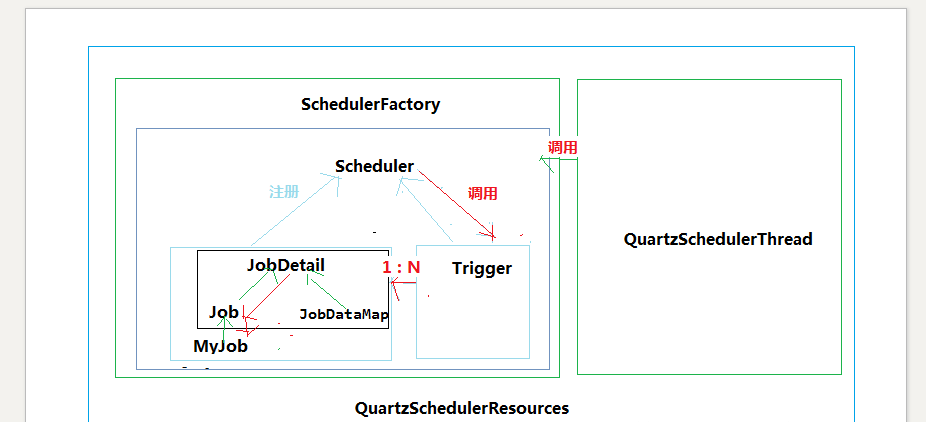

### Java Quartz

Quartz 用一个小 Java 库发布文件（.jar 文件），这个库文件包含了所有 Quartz 核心功能。这些功能的主要接口 (API) 是 Scheduler 接口。它提供了简单的操作，例如：将任务纳入日程或者从日程中取消，开始 / 停止 / 暂停日程进度。

### 定时器种类

Quartz 中五种类型的 Trigger：SimpleTrigger，CronTirgger，DateIntervalTrigger，NthIncludedDayTrigger和Calendar 类（ org.quartz.Calendar）。

最常用的：

- SimpleTrigger：用来触发只需执行一次或者在给定时间触发并且重复 N 次且每次执行延迟一定时间的任务。
- CronTrigger：按照日历触发，例如 “每个周五”，每个月 10 日中午或者 10：15 分。

### 存储方式

RAMJobStore和JDBCJobStore

一种存储在内存中，一种存储在数据库中（大概11张表）

- qrtz_blob_triggers	Trigger 作为 Blob 类型存储 (用于 Quartz 用户用 JDBC 创建他们自己定制的 Trigger 类型，JobStore 并不知道如何存储实例的时候)
- qrtz_cron_triggers	存储 Cron Trigger，包括 Cron 表达式和时区信息。
- qrtz_job_details	存储每一个已配置的 Job 的详细信息
- qrtz_triggers	存储已配置的 Trigger 的信息

### 核心类

- QuartzSchedulerThread：负责执行向 QuartzScheduler 注册的触发 Trigger 的工作的线程。
- ThreadPool：Scheduler 使用一个线程池作为任务运行的基础设施，任务通过共享线程池中的线程提供运行效率。
- QuartzSchedulerResources：包含创建 QuartzScheduler 实例所需的所有资源（JobStore，ThreadPool 等）。
- SchedulerFactory ：提供用于获取调度程序实例的客户端可用句柄的机制。
- JobStore： 通过类实现的接口，这些类要为 org.quartz.core.QuartzScheduler 的使用提供一个 org.quartz.Job 和 org.quartz.Trigger 存储机制。作业和触发器的存储应该以其名称和组的组合为唯一性。
- ：这是 Quartz 的核心，它是 org.quartz.Scheduler 接口的间接实现，包含调度 org.quartz.Jobs，注册 org.quartz.JobListener 实例等的方法。
- Scheduler ：这是 Quartz Scheduler 的主要接口，代表一个独立运行容器。调度程序维护 JobDetails 和触发器的注册表。 一旦注册，调度程序负责执行作业，当他们的相关联的触发器触发（当他们的预定时间到达时）。
- Trigger ：具有所有触发器通用属性的基本接口，描述了 job 执行的时间出发规则。 - 使用 TriggerBuilder 实例化实际触发器。
- JobDetail ：传递给定作业实例的详细信息属性。 JobDetails 将使用 JobBuilder 创建 / 定义。
- Job：要由表示要执行的 “作业” 的类实现的接口。只有一个方法 void execute(jobExecutionContext context)
(jobExecutionContext 提供调度上下文各种信息，运行时数据保存在 jobDataMap 中)

Job 有个子接口StatefulJob , 代表有状态任务。有状态任务不可并发，前次任务没有执行完，后面任务处于阻塞等到。

一个 job 可以被多个 Trigger 绑定，但是一个 Trigger 只能绑定一个 job！

### 配置文件

	//调度标识名 集群中每一个实例都必须使用相同的名称 （区分特定的调度器实例）
	org.quartz.scheduler.instanceName：DefaultQuartzScheduler
	//ID设置为自动获取 每一个必须不同 （所有调度器实例中是唯一的）
	org.quartz.scheduler.instanceId ：AUTO
	//数据保存方式为持久化 
	org.quartz.jobStore.class ：org.quartz.impl.jdbcjobstore.JobStoreTX
	//表的前缀 
	org.quartz.jobStore.tablePrefix ： QRTZ_
	//设置为TRUE不会出现序列化非字符串类到 BLOB 时产生的类版本问题
	//org.quartz.jobStore.useProperties ： true
	//加入集群 true 为集群 false不是集群
	org.quartz.jobStore.isClustered ： false
	//调度实例失效的检查时间间隔 
	org.quartz.jobStore.clusterCheckinInterval：20000 
	//容许的最大作业延长时间 
	org.quartz.jobStore.misfireThreshold ：60000
	//ThreadPool 实现的类名 
	org.quartz.threadPool.class：org.quartz.simpl.SimpleThreadPool
	//线程数量 
	org.quartz.threadPool.threadCount ： 10
	//线程优先级 
	org.quartz.threadPool.threadPriority ： 5（threadPriority 属性的最大值是常量 java.lang.Thread.MAX_PRIORITY，等于10。最小值为常量 java.lang.Thread.MIN_PRIORITY，为1）
	//自创建父线程
	//org.quartz.threadPool.threadsInheritContextClassLoaderOfInitializingThread： true 
	//数据库别名
	org.quartz.jobStore.dataSource ： qzDS
	//设置数据源
	org.quartz.dataSource.qzDS.driver:com.mysql.jdbc.Driver
	org.quartz.dataSource.qzDS.URL:jdbc:mysql://localhost:3306/quartz
	org.quartz.dataSource.qzDS.user:root
	org.quartz.dataSource.qzDS.password:123456
    org.quartz.dataSource.qzDS.maxConnection:10

### JDBC 插入表顺序

	Simple_trigger ：插入顺序
	qrtz_job_details --->  qrtz_triggers --->  qrtz_simple_triggers
	qrtz_fired_triggers
	Cron_Trigger：插入顺序
	qrtz_job_details --->  qrtz_triggers --->  qrtz_cron_triggers
	qrtz_fired_triggers

