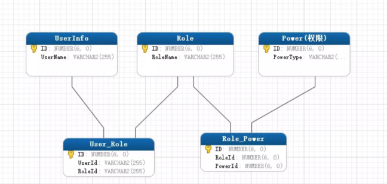
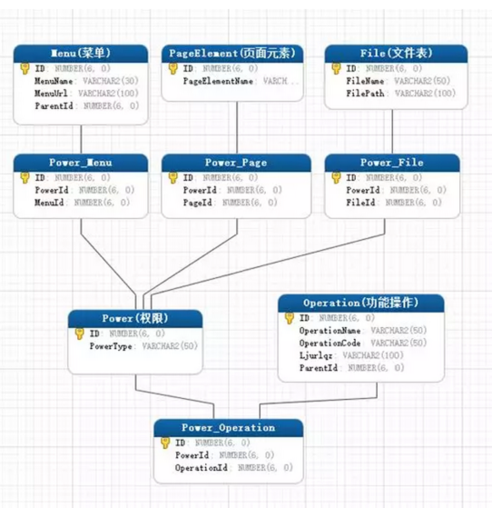
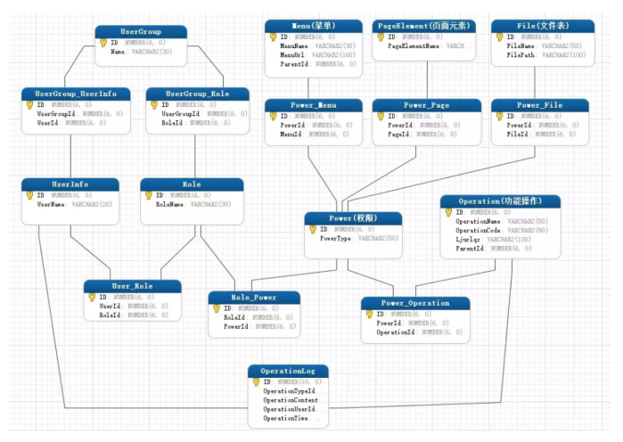

### 权限设计

比较常见的就是基于角色的访问控制，用户通过角色与权限进行关联。简单地说，一个用户拥有多个角色，一个角色拥有多个权限。这样，就构造成“用户-角色-权限”的授权模型。在这种模型中，用户与角色之间、角色与权限之间，通常都是多对多的关系。如下图：

如果用户的数量非常大的时候，就需要给系统的每一个用户逐一授权(分配角色)，这是件非常繁琐的事情，这时就可以增加一个用户组，每个用户组内有多个用户，除了给单个用户授权外，还可以给用户组授权。

通常在应用系统里面的权限我们把它表现为菜单的访问(页面级)、功能模块的操作(功能级)、文件上传的删改，甚至页面上某个按钮、图片是否可见等等都属于权限的范畴。

有些权限设计，会把功能操作作为一类，而把文件、菜单、页面元素等作为另一类，这样构成“用户-角色-权限-资源”的授权模型。而在做数据表建模时，可把功能操作和资源统一管理，也就是都直接与权限表进行关联，这样可能更具便捷性和易扩展性。如下图：

最后扩展出来的模型完整设计如下图：

