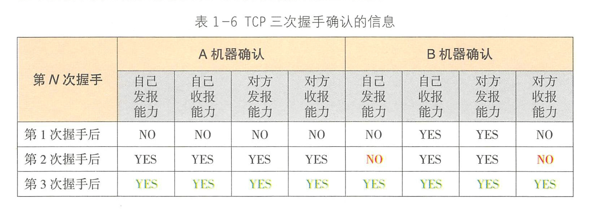
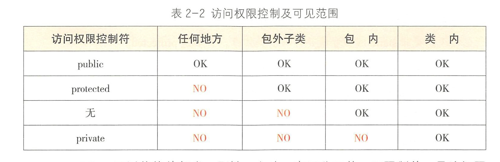
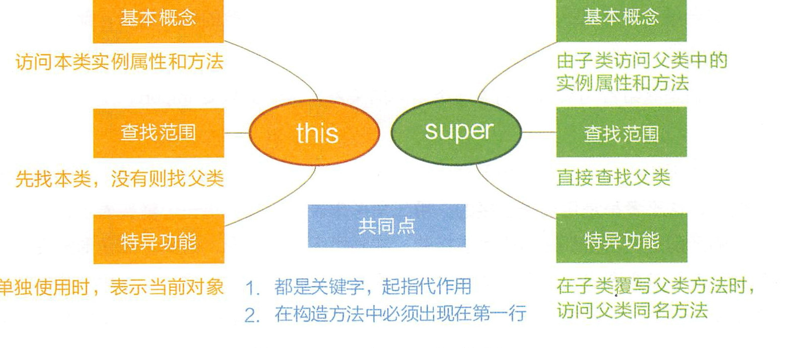

1. 位移运算，向左乘2，向右除2，符号均参与移动。除负数向右移动高位补1，其余在空位处补0。>>>无符号右移，高位均补0。没有无符号左移。实际编程中，位移只作用在整形和长整形上的。符号位0是正数。
2. true和false ，底层表示也是0和1(true&false这写法是合法的). 与& 和 | 相比，&& 和 ||具有短路功能。  
3. 浮点数的加减为什么会有误差：因为十进制的数有些不能用有限二进制数进行精确表示。导致计算机实际存储的值与真值不一样。
4. 程序在发送消息时，应用层接既定的协议打包数据， 随后由传输层加上双方的端口号，由网络层加上双方的IP 地址，由链路层加上双方的MAC 地址， 并将数据拆分成数据帧， 经过多个路由器和网关后， 至lj 达目标机器。简而言之， 就是按“ 端口→ IP 地址→ MAC 地址” 这样的路径进行数据的封装和发送，解包的时候反过来操作即可
5. 数据包的生存时间，即TTL。经常使用的ping 、tracert 命令就是基于ICMP 检测网络状态的有力工具
6. TCP建立连接的三次握手指的建立连接的三个步骤。需要三次握手的目的：信息对等和防止超时。两次握手导致的TCP 脏连接

TCP 的FLAG 位由6 个bit 组成，分别代表ACK 、SYN 、F町、URG 、PSH 、RST。TCP断开需要四次挥手。握手和挥手就是改变FLAG的值。 
7. HTTPS 的全称是HTTP over SSL ，简单的理解就是在之前的HTTP传输上增加了SSL 协议的加密能力。 
8. 对称加密可以使用相同的密钥对传输内容进行加解密。非对称加密分为公钥和私钥。私钥是用来对公钥加密的信息、进行解密的，是需要严格保密的。公钥是对信息进行加密，任何人都可以知道。一方发送信息时，使用另一方的公钥进行加密生成密文。收到密文的－方再用私钥进行解密，这样一来，传输就相对安全了。非对称加密并不是完美的，它有一个很明显的缺点是加密和解密耗时长，只适合对少量数据进行处理。我们担心对称加密中的密钥安全问题，那么将密钥的传输使用非对称加密就完美地解决了这个问题。实际上，HTTPS 也正是通过这样一种方式来建立安全的SSL连接的。 
9. HTTPS 的传输过程中，主要分为两部分首先是HTTPS 的握手，然后是数据的传输。前者是建立一个HTTPS 的通道，并确定连接使用的加密套件及数据传输使用的密钥。而后者主要使用密钥对数据加密并传输。 
10. 接口继承接口，关键字是extends ，而不是implements,允许多重继承，是因为接口有契约式的行为约定，没有任何具体实现和属性。 
11. java 访问权限及可见范围，没有权限修饰符，不要说成default。

  
 
12. this 和 super

  
 
13. java的序列化:Java 原主序列化、Hessian 序列化、JSON序列化
14. 无论是对于基本数据类型，还是引用变量， Java中的参数传递都是值。复制的传递过程。对于引用变量，复制指向对象的首地址，双方都可以通过自己的引用变量修改指向对象的相关属性。(值传递)
