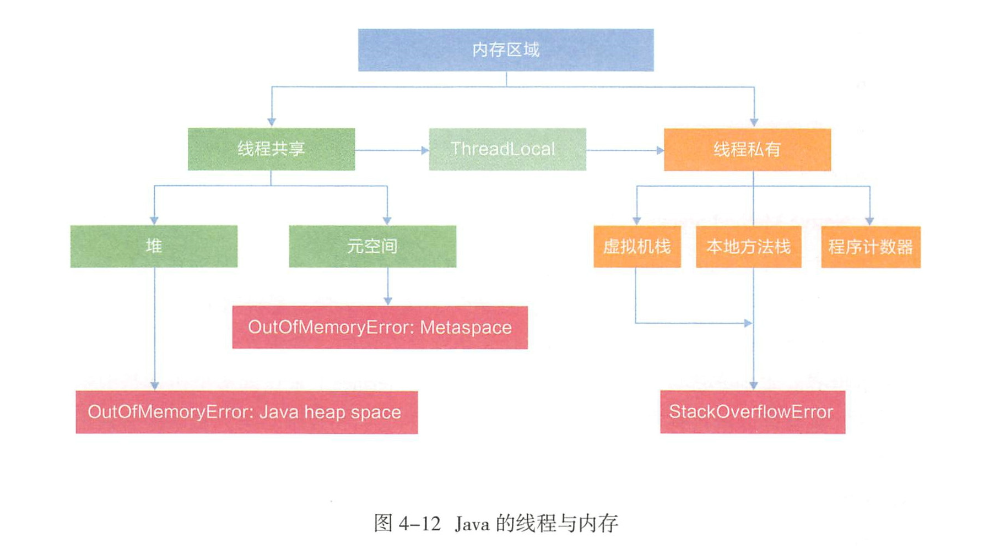
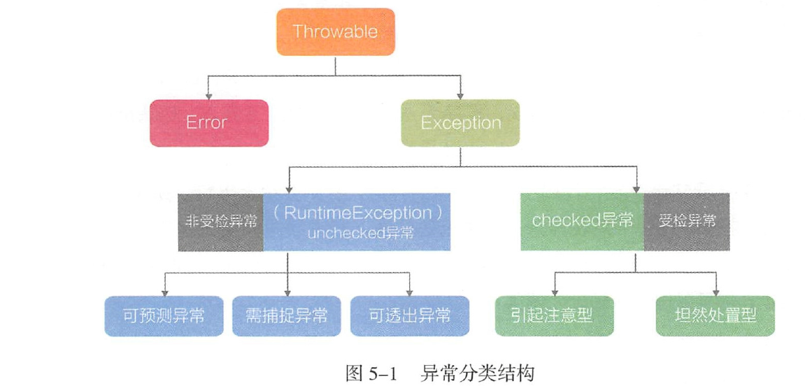

1. Perm区，译为永久代，启动时固定大小，很难进行调优，并且FGC 时会移动类无信息。如果动态加载类过多，容易产生Perm区的OOM。

        java.lang.OutOfMemoryError : PermGen space
为了解决该问题， 需要设定运行参数－XX: MaxPermSize= 1280m ，如果部署到
新机器上，往往会因为JVM参数没有修改导致故障再现。JDK8 使用元空间替换永久代。在JDK8 及以上版本中，设定MaxPermSize参数，JVM 在启动时并不会报错。

2. Java 内存模型

  
3. 为了判断对象是否存活，JVM引人了GC Roots。垃圾回收的相关算法：

   - 最基础的为标记清除算法：该算法会从每个GC Roots出发，依次标记有引用关系的对象，最后将没有被标记的对象清除。但这种算法会带来大量的空间碎片。分配一个连续较大的空间时容易引发FGC。
   - 为解决空间碎片的问题，提出标记整理算法：也会从GC Roots出发标记存活的对象，然后把存活的对象移到内存空间的一端，形成连续的已使用空间，把已使用空间之外的对象清除掉。这样就不会产生空间碎片的问题。堆内存空间分为较大的Eden 和两块较小的Survivor ，每次只使用Eden 和Survivor区的一块。现作为主流的YGC算法进行新生代的垃圾回收。

4.常用绍Serial 、CMS 、Gl。

5.异常分类
 

6.代码中不能单独存在try代码块，finally 是在return 表达式运行后执行的， 此时将要return 的结果已经被暂存起来。待finally执行完将之前暂存的结果返回。

7.在try代码块之前调用lock()方法，避免由于加锁失败导致finally 调用unlock()抛出异常

8.在使用数组转集合时，需要使用java.util.ArrayList 直接创建一个新集合，参数就是Arrays.asList 返回的不可变集合。
	
	List<Object> objectList = new java.util.ArrayList<Object>(Arrays.asList(数组));

9.任何时候覆写equals方法时，都必须同时覆写hashCode。

10.无论是JDK7 还是JDK8, ConcurrentHashMap 的size（）方法都只能返回个大概数量，无法做到100% 的精确，因为已经统计过的槽在size（）返回最终结果前有可能又出现了变化，从而导致返回大小与实际大小存在些许差异。

