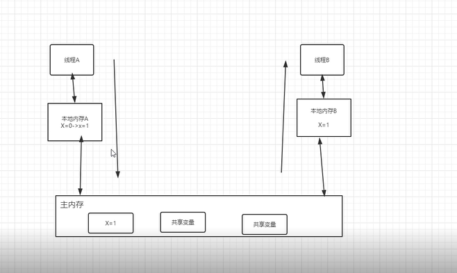
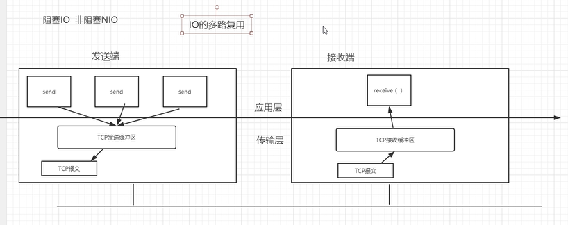
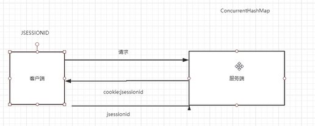
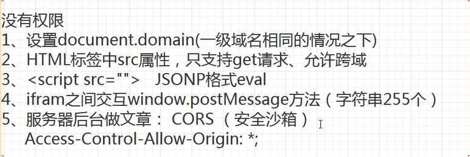
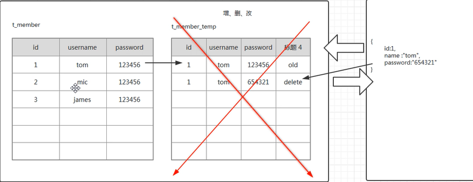

1. 面向对象都有哪些特性以及你这的理解 

     继承、封装、多态(方法重载实现编译时多态，重写实现的是运行时多态)、抽象。
2. clone()方法是浅拷贝的。深拷贝实现Cloneable接口，重写clone方法，在内部把属性再拷贝一份。

3. java语言的方法调用只支持参数的值传递。一个对象实例作为一个参数被传递到方法当中时，参数的值就是该对象的引用。
4. Java8 的 DateTimeFormatter 的 ofPattern()方法可以格式化日期。Java8引入了不少时间API如：LocalDate、LocalTime、LocalDateTime、Clock等。

5. 不能向阻塞队列中插入 null。如果插入会报空指针异常。

6. Semaphore控制并发访问线程的个数
7. 数据库三范式：第一范式：数据库中的每一列都是不可分割的。第二范式：表中的每一行都必须可以被唯一的区分（主键）第三范式：要求一个数据表中不包含已在其他表中已包含的非主键关键信息(外键)。反三范式，有的时候为了查询效率，可以设置重复的字段。

8. 通过join方法去保证多线程执行的顺序， 
  join：让当前线程等待子线程结束以后才能继续执行，(源码中用到了object的wait方法)。 另一种保证线程的执行顺序，通过创建一个单线程的线程池来保证线程的执行顺序。（原理就是用了FIFO的队列）

9. JMM：解决并发过程中如何处理可见性、原子性、有序性的问题。 
  并发编程的两个关键问题：
  a.线程之间如何通信：1.共享内存-隐式通信 2.消息传递-显示通信 
  b.线程之间如何同步：在共享内存的并发模型中，同步是显示做的，如synchronized 
                在消息传递的并发模型中，同步是隐式的
   

10. synchronized锁什么时候释放：线程执行完了代码，线程执行异常。synchronized是一个关键字，Lock是一个对象。synchronized释放锁是被动的。lock可以主动释放锁。

11. 分布式锁： 
   1.通过数据库方式去解决。比如把方法名子弹上创建一个唯一约束，请求的时候先插入一条数据。成功就获得锁。用完删除数据。存在问题：如果删除失败怎么办，这种数据库关系并不是重入锁。 
   2.使用zookeeper。 
   3.基于redis。命令setnx。

12. 阻塞IO和非阻塞IO（事件 驱动）
 
 
13. mysql的binlog：记录数据的更新或潜在更新。主从复制就是依靠binlog。

14. cookie和session本质 
 

15. JavaWeb开发中解决跨域的N种方案
 

16. 数据库提交与回滚
 

     